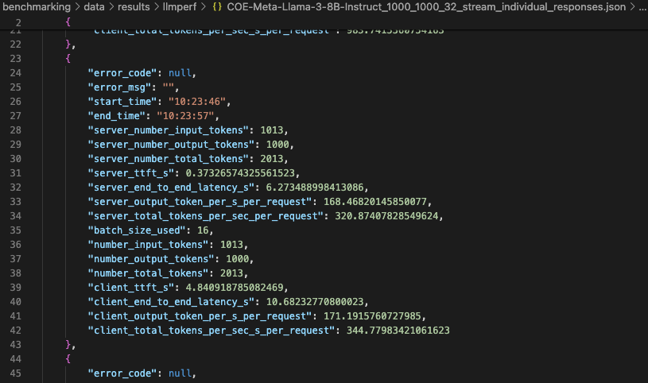
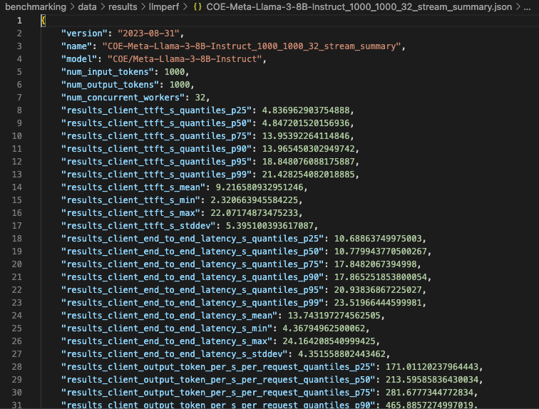
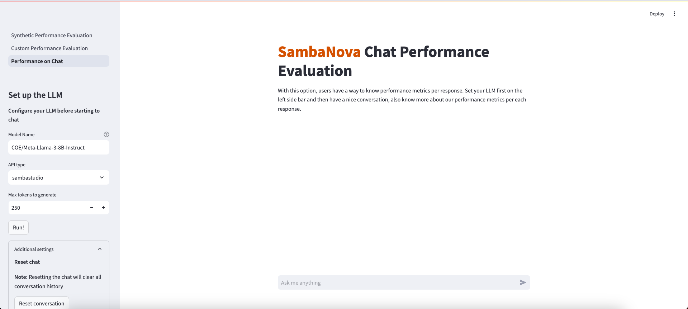
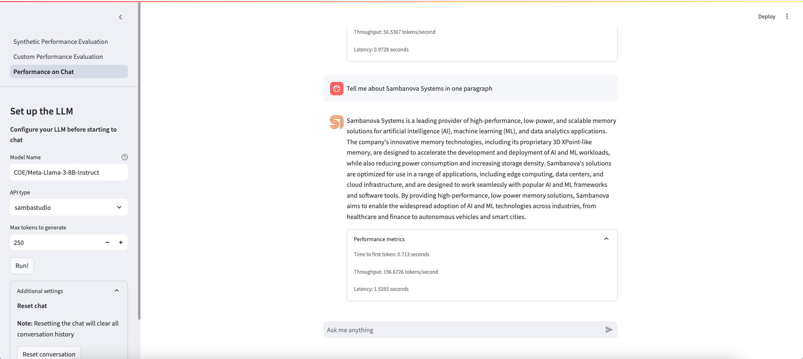

<a href="https://sambanova.ai/">
<picture>
 <source media="(prefers-color-scheme: dark)" srcset="../images/SambaNova-light-logo-1.png" height="60">
  
</picture>
</a>

Benchmarking
======================

<!-- TOC -->

- [Benchmarking](#benchmarking)
- [Overview](#overview)
- [Before you begin](#before-you-begin)
  - [Clone this repository](#clone-this-repository)
  - [Set up the account and config file](#set-up-the-account-and-config-file)
  - [Create the (virtual) environment](#create-the-virtual-environment)
- [Deploy the starter kit GUI](#deploy-the-starter-kit-gui)
  - [Use the starter kit](#use-the-starter-kit)
    - [Performance evaluation workflow](#performance-evaluation-workflow)
      - [Using streamlit app](#using-streamlit-app)
      - [Using terminal](#using-terminal)
    - [Performance on chat workflow](#performance-on-chat-workflow)
- [Batching vs non-batching benchmarking](#batching-vs-non-batching-benchmarking)
- [Third-party tools and data sources](#third-party-tools-and-data-sources)

<!-- /TOC -->

# Overview

This AI Starter Kit evaluates the performance of different LLM models hosted in SambaStudio. It allows users to configure various LLMs with diverse parameters, enabling experiments to not only generate different outputs but also measurement metrics simultaneously. The Kit includes:
- A configurable SambaStudio connector. The connector generates answers from a deployed model.
- An app with two functionalities:
    - A performance evaluation process with configurable options that users will utilize to obtain and compare different metrics 
    - A chat interface with configurable options that users will set to interact and get performance metrics
- A bash script that is the core of the performance evaluation and provides more flexibility to users

This sample is ready-to-use. We provide:
- Instructions for setup with SambaStudio
- Instructions for running the model as-is
- Instructions for customizing the model
   
# Before you begin

To perform this setup, you must be a SambaNova customer with a SambaStudio account. You also have to set up your environment before you can run or customize the starter kit. 

_These steps assume a Mac/Linux/Unix shell environment. If using Windows, you will need to adjust some commands for navigating folders, activating virtual environments, etc._

## Clone this repository

Clone the starter kit repo.
```bash
git clone https://github.com/sambanova/ai-starter-kit.git
```

## Set up the account and config file

1. Log in to SambaStudio and get your API authorization key. The steps for getting this key are described [here](https://docs.sambanova.ai/sambastudio/latest/cli-setup. 

2. Select the LLM you want to use (e.g. COE/Meta-Llama-3-8B-Instruct) and deploy an endpoint for inference. See the [SambaStudio endpoint documentation](https://docs.sambanova.ai/sambastudio/latest/endpoints.html) for a general reference, and the [Dynamic batching documentation](https://docs.sambanova.ai/sambastudio/latest/dynamic-batching.html#_create_a_dynamic_batching_coe_endpoint) for more information on how to deploy a dynamic batching endpoint. 

3. Update the `ai-starter-kit/.env` config file in the root repo directory. Here's an example:
    - Assume you have an endpoint with the URL
        "https://api-stage.sambanova.net/api/predict/generic/12345678-9abc-def0-1234-56789abcdef0/456789ab-cdef-0123-4567-89abcdef0123"

    - You can enter the following in the env file (with no spaces):

    ``` bash
        SAMBASTUDIO_BASE_URL="https://api-stage.sambanova.net"
        SAMBASTUDIO_BASE_URI="api/predict/generic"
        SAMBASTUDIO_PROJECT_ID="12345678-9abc-def0-1234-56789abcdef0"
        SAMBASTUDIO_ENDPOINT_ID="456789ab-cdef-0123-4567-89abcdef0123"
        SAMBASTUDIO_API_KEY="89abcdef-0123-4567-89ab-cdef01234567"
    ```

## Create the (virtual) environment
1. (Recommended) Create a virtual environment and activate it: 
    ```bash
    python<version> -m venv <virtual-environment-name>
    source <virtual-environment-name>/bin/activate
    ```

2. Install the required dependencies:
    ```bash
    cd benchmarking # If not already in the benchmarking folder
    pip install -r requirements.txt
    ```

# Deploy the starter kit GUI

Ensure you are in the `benchmarking` folder and run the following command:
```
streamlit run streamlit/app.py --browser.gatherUsageStats false 
```

After deploying the starter kit, you will see the following user interface:


## Use the starter kit 

After you've deployed the GUI, you can use the starter kit. More details will come in the following sections, however the general usage is described in the comming bullets: 

1. In the left side bar, select one of the two app functionalities: `Performance evaluation` or `Performance on chat`.

2. If the LLM deployed is a Composition of Experts, introduce the LLM expert and configure each of the parameters related to each functionality. Otherwise, just do the latter.

3. Press the `Run` button, wait and analyze results in the middle of the screen. In the case of `Performance on chat` functionality, users are able to interact with the LLM in a chat interface.  

### Performance evaluation workflow

There are two options that users can choose from. The first one is running the performance evaluation process using the terminal, while the other is using the Streamlit app.

#### Using streamlit app

Choose the option `Performance evaluation` on the left side bar, the following interface shows up: 


In order to use this functionality, please follow the steps below:

1. Introduce the LLM model

Under the section `Configuration`, users need to introduce the LLM model that will be used for the performance evaluation process. If it's a CoE model, add a `COE/` prefix to the name (for example, `COE/Meta-Llama-3-8B-Instruct`). If you're not sure about the name of the model/expert you want to choose, please go to the model card in SambaStudio and search for the model/expert name.

2. Choose parameter values

Different LLM parameters are available for experimentation, directly related to the previously introduced LLM. The app provides toggles and sliders to facilitate the configuration of all these parameters. Users can use the default values or modify them as needed.

- Number of input tokens: average number of input tokens. Default value: 1000.
- Number of output tokens: average number of output tokens. Default value: 1000.
- Number of total requests: maximum number of completed requests. Default value: 32. 
- Number of concurrent workers: number of concurrent workers. Default value: 1. For testing [batching-enabled models](https://docs.sambanova.ai/sambastudio/latest/dynamic-batching.html), this value should be greater than the largest batch_size one needs to test. The typical batch sizes that are supported are 1,4,8 and 16.
- Timeout: time when the process will stop. Default value: 600 seconds

1. Run the performance evaluation process

Click on the `Run!` button. It will automatically start the process. Depending on the previous parameter configuration, it should take between 1 min and 20 min. Some diagnostic/progress information will be displayed in the terminal shell.

4. See and analyze results

    _Note: Not all model endpoints currently support the calculation of server-side statistics. Depending on your choice of endpoint, then, you may see either client and server information, or you may see just the client-side information._

    **Bar plots**

    The plots compare (if available) the following:

    - **Server metrics**: These are performance metrics from the API.
    - **Client metrics**: These are performance metrics computed on the client side.
    Additionally, if the endpoint supports dynamic batching, the plots will show per-batch metrics.

    The results are composed of four bar plots:

    - ```ttft_s``` bar plot: This plot shows the Time to First Token (TTFT). One should see higher values and higher variance in the client-side metrics compared to the server-side metrics. This difference is mainly due to the request waiting in the queue to be served (for concurrent requests), which is not included in server-side metrics. There is also a small additional factor on the client-side due to the added latency of the API call to the client computer.

    - ```end_to_end_latency_s``` bar plot: This plot shows the end-to-end latency. One should see higher values and higher variance in the client-side metrics compared to the server-side metrics. This difference is also mainly due to the request waiting in the queue to be served (for concurrent requests), which is not included in server-side metrics. There is also a small additional factor on the client-side due to the added latency of the API call to the client computer.

    - ```output_token_per_s_per_request``` bar plot: This plot shows the number of output tokens per second per request. One should see good agreement between the client and server-side metrics. For endpoints that support dynamic batching, one should see a decreasing trend in metrics as the batch size increases.

    - ```throughput_token_per_s``` bar plot: This plot shows the total tokens generated per second per batch. One should see good agreement between the client and server-side metrics. This metric represents the total number of tokens generated per second, which is the same as the previous metric for batch size = 1. However, for batch size > 1, it is estimated as the average of ```output_token_per_s_per_request * batch_size_used``` for each batch, to account for more tokens being generated due to concurrent requests being served in batch mode.
#### Using terminal

Users have this option if they want to experiment using values that are beyond the limits specified in the Streamlit app parameters.

1. Open the file `run.sh` and configure the following parameters in there:

   - model: model name to be used. If it's a COE model, add "COE/" prefix to the name. Example: "COE/Meta-Llama-3-8B-Instruct"
   - mean-input-tokens: average number of input tokens. It's recommended to choose no more than 2000 tokens to avoid long waitings. Default value: 1000.
   - mean-output-tokens: average number of output tokens. It's recommended to choose no more than 2000 tokens to avoid long waitings. Default value: 1000.
   - max-num-completed-requests: maximum number of completed requests. Default value: 32 
   - num-concurrent-workers: number of concurrent workers. Default value: 1. 
   - timeout: time when the process will stop. Default value: 600 seconds
   - results-dir: path to the results directory. Default value: "./data/results/llmperf"
   - additional-sampling-params: additional params for LLM. Default value: '{}'

2. Run the following command in terminal. The performance evaluation process will start running and a progress bar will be shown until it is done.

```
sh run.sh
```

3. Review and analyze results. Results will be saved in `results-dir` location, and the name of the output files will depend on the model name, number of mean input/output tokens, number of concurrent workers, and generation mode, like the following:

```
<MODEL_NAME>_{NUM_INPUT_TOKENS}_{NUM_OUTPUT_TOKENS}_{NUM_CONCURRENT_WORKERS}_{MODE}
```

For each run, two files are generated with the following suffixes in the output file names: `_individual_responses` and `_summary`.

- Individual responses file 

This output file contains the number of input and output tokens, number of total tokens, Time To First Token (TTFT), End-To-End Latency (E2E Latency) and Throughput from Server (if available) and Client side, for each individual request sent to the LLM. Users can use this data for further analysis. We provide this notebook `notebooks/analyze-token-benchmark-results.ipynb` with some charts that they can use to start.



- Summary file

This file includes various statistics such as percentiles, mean and standard deviation to describe the number of input and output tokens, number of total tokens, Time To First Token (TTFT), End-To-End Latency (E2E Latency) and Throughput from Client side. It also provides additional data points that bring more information about the overall run, like inputs used, number of errors, and number of completed requests per minute. 



### Performance on chat workflow

Choose the option `Performance on chat` on the left side bar, the following interface shows up: 



In order to use this functionality, please follow the steps below:

1. Introduce the LLM model

Under section `Set up the LLM`, users need to introduce the LLM model that will be used for chatting. If it's a COE model, add "COE/" prefix to the name. Example: "COE/Meta-Llama-3-8B-Instruct". If you're not sure about the name of the model/expert you want to choose, please go to the model card in SambaStudio and search for the model/expert name.

2. Choose LLM parameter values

Different LLM parameters are available for experimentation depending on the LLM model deployed. These are directly related to the previously introduced LLM. The app provides various options to facilitate the configuration of all these parameters. Users can use the default values or modify them as needed.

<!-- - Do sample (True, False) -->
- Max tokens to generate (from 50 to 2048)
<!-- - Repetition penalty (from 1 to 10)
- Temperature (from 0.01 to 1)
- Top k (from 1 to 1000)
- Top p (from 0.01 to 1.00) -->

3. Set up the LLM model

After introducing the LLM and configuring the parameters, users have to press the `Run` button on the bottom. It will automatically set up the introduced LLM and activate the chat interface for upcoming interactions.

4. Ask anything and see results

Users are able to ask anything and get a generated answer of their questions, as showed in the image bellow. In addition to the back and forth conversations between the user and the LLM, there is a expander option that users can click to see the following metrics per each LLM response:
- Latency (s)
- Throughput (tokens/s)
- Time to first token (s)



# Batching vs non-batching benchmarking

This kit also supports [SambaNova Studio models with Dynamic Batch Size](https://docs.sambanova.ai/sambastudio/latest/dynamic-batching.html), which improves the model performance significantly. 

In order to use a batching model, first users need to set up the proper endpoint supporting this feature, please [look at this section](#set-up-the-account-and-config-file) for reference. Additionally, users need to specify `number of workers > 1`, either using [the streamlit app](#using-streamlit-app) or [the terminal](#using-terminal). Since the current maximum batch size is 16, it's recomended to choose a value for `number of workers` equal or greater than that to test different batch sizes. 

Here's an example with parameters for using an endpoint with and without dynamic batching size.

Non-batching setup
- Parameters:
  - Number of requests: 32
  - Number of concurrent workers: 1

Batching setup
- Parameters:
  - Number of requests: 32
  - Number of concurrent workers: 32


# Third-party tools and data sources 

All the packages/tools are listed in the requirements.txt file in the project directory. Some of the main packages are listed below:

- streamlit (version 1.34.0)
- st-pages (version 0.4.5)
- transformers (version 4.40.1)
- python-dotenv (version 1.0.0)
- Requests (version 2.31.0)
- seaborn (version 0.12.2)
