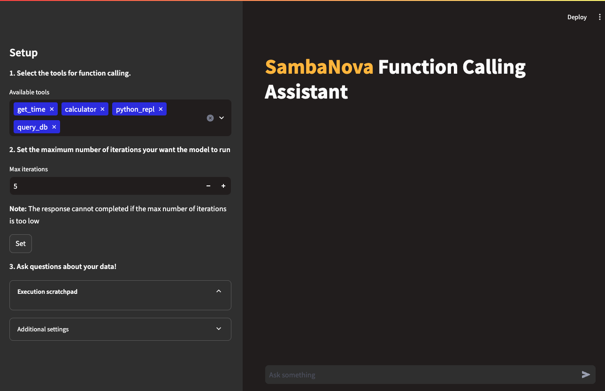

<a href="https://sambanova.ai/">
<picture>
 <source media="(prefers-color-scheme: dark)" srcset="../images/SambaNova-light-logo-1.png" height="60">
  
</picture>
</a>

# Function Calling kit
======================

This function calling kit is an example of tools calling implementation and a generic function calling module that can be used inside your application workflows.

<!-- TOC -->

- [Function Calling kit](#function-calling-kit)
- [Before you begin](#before-you-begin)
    - [Clone this repository](#clone-this-repository)
        - [Set up the inference endpoint, configs and environment variables](#set-up-the-inference-endpoint-configs-and-environment-variables)
        - [Update the Embedding API information](#update-the-embedding-api-information)
    - [Install dependencies](#install-dependencies)
- [Use the Function Calling kit](#use-the-function-calling-kit)
    - [Quick start](#quick-start)
    - [Streamlit App](#streamlit-app)
    - [Customizing the Function Calling module](#customizing-the-function-calling-module)
- [Third-party tools and data sources](#third-party-tools-and-data-sources)

<!-- /TOC -->

# Before you begin

To use this in your application you need an instruction model, we recommend to use the Meta Llama3 70B or Llama3 8B, from SambaStudio CoE.

## Clone this repository

Clone the starter kit repo.
```
git clone https://github.com/sambanova/ai-starter-kit.git
```

### Set up the inference endpoint, configs and environment variables

The next step is to set up your environment variables to use one of the models available from SambaNova. If you're a current SambaNova customer, you can deploy your models with SambaStudio. If you are not a SambaNova customer, you can self-service provision API endpoints using SambaNova Cloud.

- If using **SambaStudio** Please follow the instructions [here](../README.md#use-sambastudio-option-3) for setting up endpoint and your environment variables.
    Then in the [config file](./config.yaml) set the llm `api` variable to `"sambastudio"`, set the `CoE` and `select_expert` configs if using a CoE endpoint.

- If using **SambaNova Cloud** Please follow the instructions [here](../README.md#use-sambanova-fast-api-option-1) for setting up your environment variables.
    Then in the [config file](./config.yaml) set the llm `api` variable to `"sncloud"` and set the `select_expert` config depending on the model you want to use.

### Update the Embedding API information

You have these options to specify the embedding API info:

* **Option 1: Use a CPU embedding model**

    In the [config file](./config.yaml), set the variable `type` in `embedding_model` to `"cpu"`

* **Option 2: Set a SambaStudio embedding model**

To increase inference speed, you can use a SambaStudio embedding model endpoint instead of using the default (CPU) Hugging Face embeddings.

1. Follow the instructions [here](../README.md#use-sambastudio-option-1) for setting up your environment variables.

2. In the [config file](./config.yaml), set the variable `type` `embedding_model` to `"sambastudio"` and set the configs `batch_size`, `coe` and `select_expert` according your sambastudio endpoint

    > NOTE: Using different embedding models (cpu or sambastudio) may change the results, and change How the embedding model is set and what the parameters are. 

## Install dependencies

We recommend that you run the starter kit in a virtual environment.

NOTE: python 3.10 or higher is required to use this kit.

1. Install the python dependencies in your project environment.

    ```bash
    cd ai_starter_kit/function_calling
    python3 -m venv function_calling_env
    source function_calling_env/bin/activate
    pip  install  -r  requirements.txt
    ```

# Use the Function Calling kit 

## Quick start

We provide a simple module for using the Function Calling LLM, for this you will need:

1. Create your set of tools:

    You should create a set of tools that you want the model to be able to use, those tools, should be langchain tools.

    We provide an example of different langchain integrated tools and implementation of custom tools in [src/tools.py](src/tools.py), and in the [step by step notebook](./notebooks/function_calling_guide.ipynb).

    > See more in [langchain tools](https://python.langchain.com/v0.1/docs/modules/tools/)

2. Instantiate your Function calling LLM, passing the model to use (Sambastudio), and the required tools as argument, then you can invoke the function calling pipeline using the `function_call_llm` method passing the user query

    ``` python
        from function_calling.src.function_calling  import FunctionCallingLlm
        
        ### Define your tools
        from function_calling.src.tools import get_time, calculator, python_repl, query_db
        tools = [get_time, calculator, python_repl, query_db]

        fc = FunctionCallingLlm(tools)

        fc.function_call_llm("<user query>", max_it=5, debug=True)
    ```

    we provide an [usage notebook](notebooks/usage.ipynb) that you can use as a guide for using the function calling module


## Streamlit App

We provide a simple GUI that allows you to interact with your function calling model

To run it execute the following command 

```bash
    streamlit run streamlit/app.py --browser.gatherUsageStats false 
```

After deploying the starter kit GUI App you see the following user interface:



On that page you will be able to select your function calling tools and the max number of iterations available for the model to answer your query.

## Customizing the Function Calling module

The example module can be further customized based on the use case.

The complete tools generation, methods, prompting and parsing for implementing function calling, can be found and further customized for your specific use case following the [Guide notebook](function_calling_guide.ipynb)  

# Third-party tools and data sources

All the packages/tools are listed in the `requirements.txt` file in the project directory. Some of the main packages are listed below:

* python-dotenv (version 1.0.1)
* langchain (version 0.2.11)
* langchain-community (version 0.2.10)
* langchain-experimental (version 0.0.6)
* sseclient-py (version 1.8.0)
