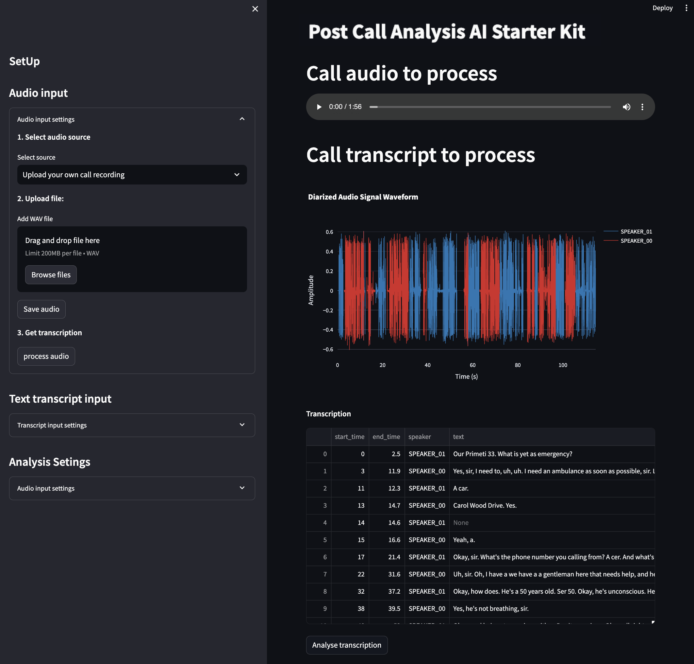
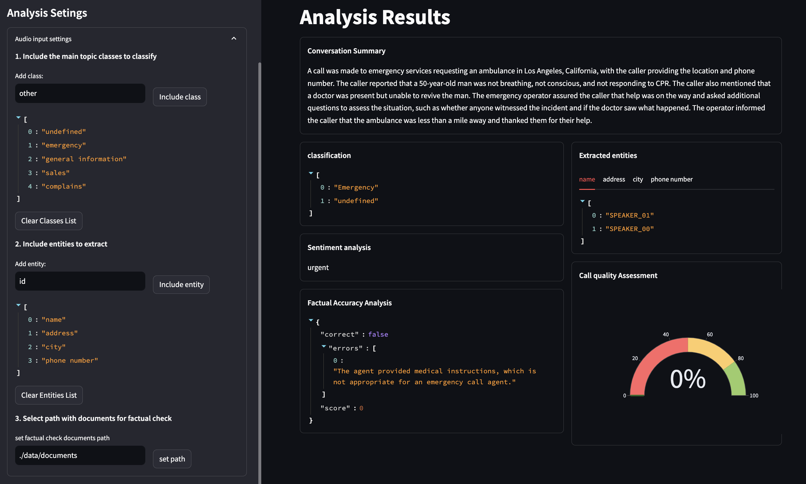

<a href="https://sambanova.ai/">
<picture>
  <source media="(prefers-color-scheme: dark)" srcset="../images/SambaNova-light-logo-1.png" height="60">
  
</picture>
</a>

Post Call Analysis
======================
<!-- TOC -->

- [Post Call Analysis](#post-call-analysis)
- [Overview](#overview)
    - [About this template](#about-this-template)
- [Getting started](#getting-started)
    - [Deploy your models in SambaStudio](#deploy-your-models-in-sambastudio)
        - [Deploy your LLM](#deploy-your-llm)
        - [Use the automatic Speech Recognition Pipleine](#use-the-automatic-speech-recognition-pipleine)
    - [Set the starter kit and integrate your models](#set-the-starter-kit-and-integrate-your-models)
    - [Deploy the starter kit](#deploy-the-starter-kit)
- [Starterkit usage](#starterkit-usage)
- [Workflow](#workflow)
    - [Audio processing](#audio-processing)
        - [Trascription](#trascription)
        - [Diarization](#diarization)
    - [Analysis](#analysis)
        - [Transcript Reduction](#transcript-reduction)
        - [Summarization](#summarization)
        - [Classification](#classification)
        - [Named entity recognition](#named-entity-recognition)
        - [Sentiment Analysis](#sentiment-analysis)
        - [Factual Accuracy Analysis](#factual-accuracy-analysis)
        - [Procedure Analysis](#procedure-analysis)
        - [Call Quality Assessment](#call-quality-assessment)
- [Customizing the template](#customizing-the-template)
    - [Large language model LLM](#large-language-model-llm)
        - [Fine tune your model](#fine-tune-your-model)
        - [Prompt engineering](#prompt-engineering)
        - [Factual Accuracy Analysis](#factual-accuracy-analysis)
        - [Call Quality Assessment](#call-quality-assessment)
        - [Batch Inference](#batch-inference)
- [Third-party tools and data sources](#third-party-tools-and-data-sources)

<!-- /TOC -->

# Overview
## About this template

This AI Starter Kit exemplifies a systematic approach to post-call analysis starting with Automatic Speech Recognition (ASR), diarization, large lenguage model analysis, and retrieval augmented generation (RAG) workflows that are built using the SambaNova platform, this template provides:

-   A customizable SambaStudio connector facilitating LLM inference from deployed models.
-   A configurable SambaStudio connector enabling ASR pipeline inference from deployed models.
-   Implementation of the RAG workflow alongside prompt construction strategies tailored for call analysis, including:
    - Call Sumarization
    - Classification
    - Named Entity recognition
    - Sentiment Analysis
    - Factual Accuracy Analysis
    - Call Quality Assessment

This sample is ready to use. We provide instructions to help you run this demo by following a few simple steps described in the [Getting Started](#getting-started) section. it also includes a simple explanation with useful resources for understanding what is happening in each step of the [workflow](#workflow), Then it also serves as a starting point for customization to your organization's needs, which you can learn more about in the [Customizing the Template](#customizing-the-template) section.

# Getting started

## Deploy your models in SambaStudio

### Deploy your LLM

Begin by deploying your LLM of choice (e.g. Llama 2 70B chat, etc) to an endpoint for inference in SambaStudio either through the GUI or CLI, as described in the [SambaStudio endpoint documentation](https://docs.sambanova.ai/sambastudio/latest/endpoints.html).

### Use the automatic Speech Recognition Pipleine

This Starter kit automatically will use the Sambanova CLI Snapi to create an ASR pipleine project and run batch inference jobs for doing speech recognition steps, you will only need to set your environment API Authorization Key (The Authorization Key will be used to access to the API Resources on SambaStudio), the steps for getting this key is decribed [here](https://docs.sambanova.ai/sambastudio/latest/cli-setup.html#_acquire_the_api_key)

## Set the starter kit and integrate your models

Set your local environment and Integrate your LLM deployed on SambaStudio with this AI starter kit following this steps:

1. Clone repo.
    ```
    git clone https://github.com/sambanova/ai-starter-kit.git
    ```
2. Update API information for the SambaNova LLM and your environment [sambastudio key](#use-the-automatic-speech-recognition-pipleine). 
    
    These are represented as configurable variables in the environment variables file in the root repo directory **```sn-ai-starter-kit/export.env```**. For example, an endpoint with the URL
    "https://api-stage.sambanova.net/api/predict/nlp/12345678-9abc-def0-1234-56789abcdef0/456789ab-cdef-0123-4567-89abcdef0123"
    and and a samba studio key ```"1234567890abcdef987654321fedcba0123456789abcdef"```
    would be entered in the environment file (with no spaces) as:
    ```
    BASE_URL="https://api-stage.sambanova.net"
    PROJECT_ID="12345678-9abc-def0-1234-56789abcdef0"
    ENDPOINT_ID="456789ab-cdef-0123-4567-89abcdef0123"
    API_KEY="89abcdef-0123-4567-89ab-cdef01234567"
    VECTOR_DB_URL=http://host.docker.internal:6333
    SAMBASTUDIO_KEY="1234567890abcdef987654321fedcba0123456789abcdef"
    ```
3. Install requirements.

    It is recommended to use virtualenv or conda environment for installation, and to update pip.
    ```
    cd ai-starter-kit/post_call_analysis
    python3 -m venv post_call_analysis_env
    source post_call_analysis_env/bin/activate
    pip install -r requirements.txt
    ```
4. Download and install Sambanova CLI.

    Follow the instructions in this [guide](https://docs.sambanova.ai/sambastudio/latest/cli-setup.html) for installing Sambanova SNSDK and SNAPI, (you can omit the *Create a virtual environment* step since you are using the just created ```post_call_analysis_env``` environment)

5. Set up config file.

    - Uptate de value of the base_url key in the ```urls``` section of [```config.yaml```](config.yaml) file. Set it with the url of your sambastudio environment
    -  Uptate de value of the asr_with_diarization_app_id key in the apps section of [```config.yaml```](config.yaml) file. to find this app id you should execute the following comand in your terminal:
        ```
        snapi app list 
        ```
    - Search for the ```ASR With Diarization``` section in the oputput and copy in the config file the ID value.

## Deploy the starter kit

To run the demo, run the following command

```
streamlit run streamlit/app.py   
```

After deploying the starter kit you should see the following streamlit user interface


# Starterkit usage 

1- Pick your source (Audio or Transcription). You can upload your call audio recording or a CSV file containing the call transcription with diarization. Alternatively, you can select a preset/preloaded audio recording or a preset/processed call transcription.

> The audio recording should be in .wav format

2- Save the file and process it. If the input is an audio file, the processing step could take a couple of minutes to initialize the bash inference job in SambaStudio. Then you will see the following output structure.



> Be sure to have at least 3 RDUs available in your SambaStudio environment

3- Set the analysis parameters. Here, you can define a list of classes for classification, specify entities for extraction.

Also you should provide the input path containing your facts and procedures knowledge bases, or you can include a list of urls you want to scrape to include it as facts and procedures knowledge bases

> With this default template only txt and pdf files or urls will be used for factual and procedures check.  

4- Click the Analyse transcription button an this will execute the analysis steps over the transcription, this step could take a copule of minutes, Then you will see the following output structure.



# Workflow

## Audio processing

This step is made by the SambaStudio batch inference pipeline for ASR and Diarization and is composed of these models.

### Trascription

In the Transcription step involves converting the audio data from the call into text format. This step utilizes Automatic Speech Recognition (ASR) technology to accurately transcribe spoken words into written text.

### Diarization

The Diarization process distinguishing between different speakers in the conversation. It segments the audio data based on speaker characteristics, identifing each speacker audio segments, enabling further analysis on a per-speaker basis.

This pipeline retrives a csv containing times of the audio segments with speaker labels and correpsonding transcription assigned to each segment.

## Analysis

### Transcript Reduction

Transcript reduction involves condensing the transcribed text to eliminate redundancy and shorten it enough to fit within the context length of the LLM. This results in a more concise representation of the conversation. This process is achieved using the [reduce](https://api.python.langchain.com/en/latest/chains/langchain.chains.combine_documents.reduce.ReduceDocumentsChain.html) langchain chain and the [```reduce prompt template```](./prompts/reduce.yaml), which iteratively takes chunks of the conversation and compresses them while preserving key ideas and entities."

### Summarization

Summarization generates a brief abstractive overview of the conversation, capturing its key points and main themes. This aids in quickly understanding the content of the call, This process is achieved using the [```summarization prompt template```](./prompts/sumarization.yaml)

### Classification

Classification categorizes the call based on its content or purpose by assigning it to a list of predefined classes or categories. This zero-shot classification is achieved using the [```classification prompt template```](./prompts/topic_clasification.yaml), which utilizes the reduced call transcription and a list of possible classes, this is pased over the langchain [list output parser](https://python.langchain.com/docs/modules/model_io/output_parsers/types/csv) to get a list structure as result.

### Named entity recognition

Named Entity Recognition (NER) identifies and classifies named entities mentioned in the conversation, such as names of people, organizations, locations, and other entities of interest. This process utilizes a provided list of entities to extract and the reduced conversation, using the [```NER prompt template```](./prompts/ner.yaml). The output then is parsed with the langchain [Structured Output parser](https://python.langchain.com/docs/modules/model_io/output_parsers/types/structured), which converts it into a JSON structure containing a list of extracted values for each entity.

### Sentiment Analysis

Sentiment Analysis determines the overall sentiment expressed in the conversation by the user. This helps in gauging the emotional tone of the interaction, this is achived using the [```sentiment analysis prompt template```](./prompts/sentiment_analysis.yaml)

### Factual Accuracy Analysis


Factual Accuracy Analysis evaluates the factual correctness of statements made during the conversation by the agent,  This is achieved using a RAG methodology, in which:

- A series of documents are loaded, chunked, embedded, and stored in a vectorstore database.
- Using the [```Factual Accuracy Analysis prompt template```](./prompts/factual_accuracy_analysis.yaml) and a [retrieval](https://api.python.langchain.com/en/latest/chains/langchain.chains.retrieval.create_retrieval_chain.html) langchain chain, relevant documents for factual checks and procedures are retrieved and contrasted with the call transcription.
- The output is then parsed using the langchain [Structured Output parser](https://python.langchain.com/docs/modules/model_io/output_parsers/types/structured), which converts it into a JSON structure containing a 'correctness' field, an 'error' field containing a description of the errors evidenced in the transcription, and a 'score' field.

### Procedure Analysis

Procedures Analysis evaluates if the agent follows some given proceduresduring the conversation, also ensuring that the agent's procedures correspond with procedural guidelines. is achived using the [```procedures analysis prompt template```](./prompts/procedures_analysis.yaml)

- The output is then parsed using the langchain [Structured Output parser](https://python.langchain.com/docs/modules/model_io/output_parsers/types/structured), which converts it into a JSON structure containing a 'correctness' field, an 'error' field containing a description of the errors evidenced in the transcription, and a 'score' field.

### Call Quality Assessment

Call Quality Assessment evaluates agent accuracy aspects in the call. It helps in identifying areas for improvement in call handling processes. In this template, a basic analysis is performed alongside the [Factual Accuracy Analysis](#factual-accuracy-analysis) and [Procedure Analysis](#procedure-analysis) steps, in which a score is given according to the errors made by the agent in the call, and a prdiction of a score (NPS) the user could give to the attention receibed. This is achieved using the get_call_quallity_assesment method in the [Analysis script](./src/analysis.py).
# Customizing the template

## Large language model (LLM)

### Fine tune your model
The template uses the SN LLM model, which can be further fine-tuned to improve response quality. To train a model in SambaStudio, learn how to [prepare your training data](https://docs.sambanova.ai/sambastudio/latest/generative-data-prep.html), [import your dataset into SambaStudio](https://docs.sambanova.ai/sambastudio/latest/add-datasets.html) and [run a training job](https://docs.sambanova.ai/sambastudio/latest/training.html)

### Prompt engineering
Finally, prompting has a significant effect on the quality of LLM responses. All Prompts used in [Analysis section](#analysis) can be further customized to improve the overall quality of the responses from the LLMs. For example, in the given template, the following prompt was used to generate a response from the LLM, where ```question``` is the user query and ```context``` are the documents retrieved by the retriever.
```yaml
template: |
          <s>[INST] <<SYS>>\nUse the following pieces of context to answer the question at the end.
          If the answer is not in context for answering, say that you don't know, don't try to make up an answer or provide an answer not extracted from provided context.
          Cross check if the answer is contained in provided context. If not than say \"I do not have information regarding this.\"\n
          context
          {context}
          end of context
          <</SYS>>/n
          Question: {question}
          Helpful Answer: [/INST]
)
```
> *Learn more about [Prompt engineering](https://www.promptingguide.ai/)*


### Factual Accuracy Analysis

You can also customize or add specific document loaders in the `load_files` method, which can be found in the [vectordb class](../vectordb/vector_db.py). We also provide several examples of document loaders for different formats with specific capabilities in the [data extraction starter kit](../data_extraction/README.md).

### Call Quality Assessment

The example provided in this template is basic but can be further customized to include your specific metrics in the evaluation steps. You can also modify the output parsers to obtain extra data or structures in the [analysis script](./src/analysis.py) methods.

### Batch Inference

In the [analysis](./notebooks/analysis.ipynb), [asr](./notebooks/asr.ipynb) notebooks, and [analysis](./src/analysis.py), [asr](./src/asr.py) scripts, you will find methods that can be used for batch analysis of multiple calls.


# Third-party tools and data sources

All the packages/tools are listed in the requirements.txt file in the project directory. Some of the main packages are listed below:

- langchain (version 0.1.2)
- python-dotenv (version 1.0.1)
- requests (2.31.0)
- pydantic (1.10.14)
- unstructured (0.12.4)
- sentence_transformers (2.2.2)
- instructorembedding (1.0.1)
- faiss-cpu (1.7.4)
- streamlit (1.31.1)
- streamlit-extras (0.3.6)
- watchdog (4.0.0)
- sseclient (0.0.27)
- plotly (5.19.0)
- nbformat (5.9.2)
- librosa (0.10.1)
- streamlit_javascript (0.1.5)
